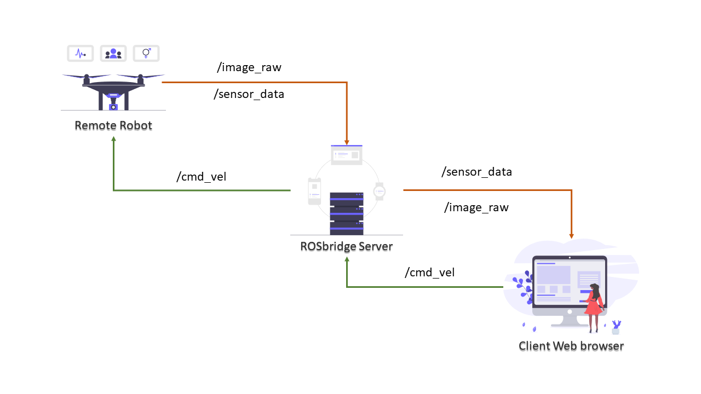

# ROSserver_webclient_interface
A ROSServer - uses rosbridge web socket and a python HTTP server to run a web server for the client web interface.

## Simple ROS server webclient interface Illustration

